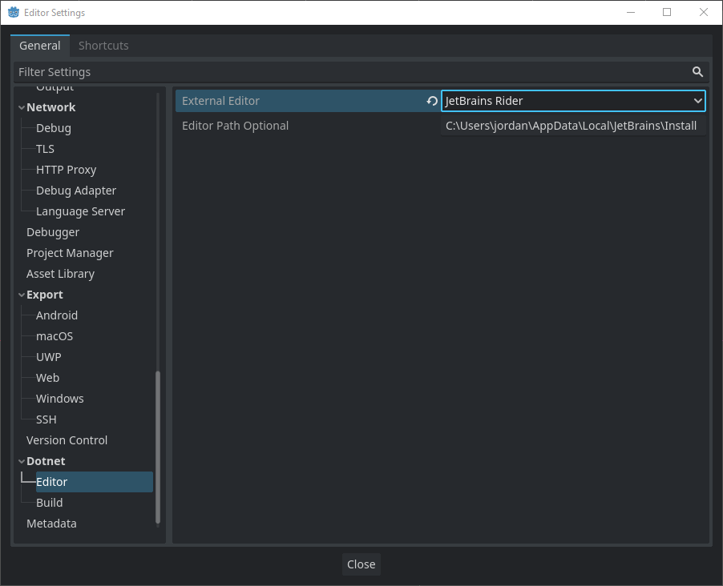
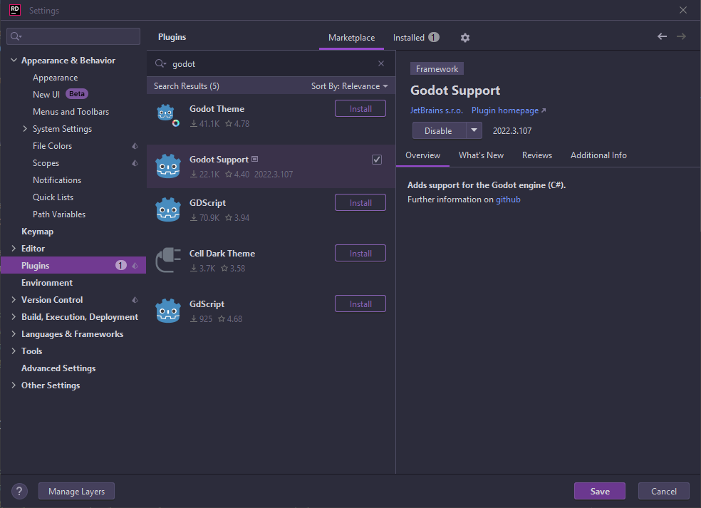
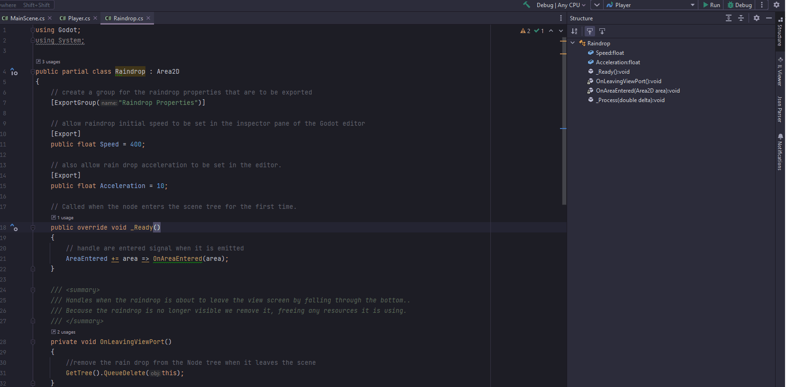
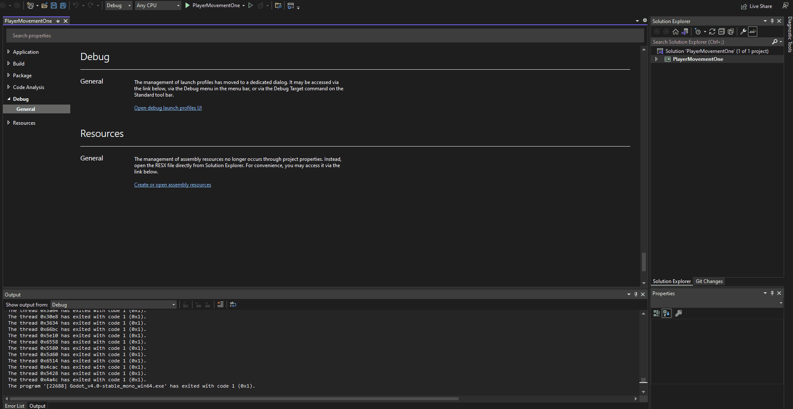

C# Toolchain
============

Due to the complexity of the C# namespaces it is likely that you will want to use something other than the Godot editor for writing your code.

Some possibilities are  IDEs like Jetbrains' Rider and Visual Studio, or an enhanced editor like Visual Studio Code.

If your planing on using an external editor or IDE you should set the Godot editor to launch the external editor.  Once you set the external editor,
you will no longer be able to generate code to connect signals.  However when it does generate these methods it places the code outside the context of the class definition,
and honestly it's much easier to hook the signals up in code anyway.

To set up the external editor, click the Editor menu item, and scroll down till you see DotNet.  Select editor, and select your IDE / Editor from the drop down.
In my case Rider does not start up unless I provide the full path so I have.

If your using Jetbrains Rider, then once you install the Godot plugin setup is done.

Your now ready to debug not just game code but editor tool code as well,
depending on the selected configuration, for any Godot project you happen to be working on.  Rider is also cross platform running in Linux, Mac, and Windows.

Visual Studio also provides a fully integrated development environment. However at the time of writing the debug process has to be set up on a per project basis.

After creating your project in the Godot editor and generating the C# solution file, open the solution file in Visual Studio, once the project has loaded right click
the project and select Properties from the list.  This will allow debugging of games.

1. Under properties select Debug, and then click the link to open the Debug launch profiles dialog.
2. Delete the current profile, and add an executable profile.
3. Set the executable path to point to the main Godot exe.
4. Set arguments to be --path .
5. Set Working Directory to be .
6. Scroll down and check the box beside Native Debugging

To allow the debugging of editor tools in Visual Studio, create another profile same as the first but add --editor to the arguments.
