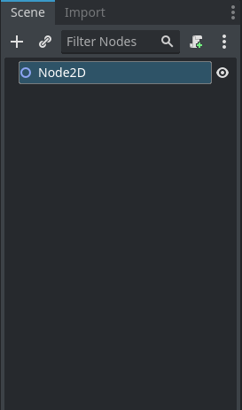

.. _introduction-part-one:

Nodes and Scenes
================

In Godot all aspects of the game are represented by nodes. A node can be a sprite, an audio clip, an animation, or anything else that is required by your game project. Nodes are organized in a tree structure in much the same way as XML nodes are organized. A group of nodes arranged in a tree constitutes a scene. Every node has a few things in common:

* Name - each node can be referred to by name
* Properties - every node has a whole set of properties that define how it looks, acts, etc.
* Callback - each has a callback function that can be set to process during every frame
* Extendable - with code, any node can be extended to have additional properties and functionality

In a tree, every node can have one (and only one) parent and any number of children. A node can inherit behavior and properties from its parent, allowing you to organize them in a logical manner.

In Godot, `scenes <https://docs.godotengine.org/en/stable/getting_started/step_by_step/nodes_and_scenes.html>`_ can be saved/loaded, duplicated, and can even spawn other scenes.

Startup the Godot editor, and choose to create a new project. Once the project loads it will look like the following. Click the highlighted button that is labeled 2D Scene.

A new 2D scene has now been created, and the scene tab should now list it.

Right click the newly created node and choose Add Child Node, when the Create New Node dialog appears choose to add a new Sprite2D

Once the sprite has been added, we have to texture it so that there is something to display. Drag the icon.svg file from the File System tab:

Drop it on the texture property for the newly created Sprite2D object:

.. image:: img/101-scripting-sprite-texture.png

The initial scene has now been created, and can be run if you wish.  The controls are in the upper right corner of the Godot editor.

For now simply choose run current scene, or use the keyboard shortcut of F6.  We will be setting the main scene later so do not click run main scene yet.

However all it does at this point is render the sprite, this can be easily remedied by extending the sprite object using Godot's built in scripting.

Godot Scripts
-------------

Now add a `script <https://docs.godotengine.org/en/stable/getting_started/step_by_step/scripting_languages.html>`_ to the sprite node by right clicking the node and selecting Attach Script.  When the Attach Script dialog appears choose the type of script you wish to create.

.. tabs::

   .. tab:: C#

      .. image:: img/101-scripting-attach-csharp.png

      After attaching the script the Godot editor will open the newly created C# partial class.

     .. image:: img/101-scripting-csharp-script-editor.png

   .. tab:: GDScript

      .. image:: img/101-scripting-attach-script-gd.png

      After attaching the script. the Godot editor will open the newly created GD script object

      .. image:: img/101-scripting-gdscript-editor.png

Now add some functionality to the script to first print the starting position of the sprite, and then move the sprite
down and to the right by having it increase it's position by 100 pixels on the X axis (to the right), and 50 pixels
on the Y axis (down).

1. Add object wide field to the object to define the velocity (movement size).
2. Add code to the `_Ready <https://docs.godotengine.org/en/stable/classes/class_node.html#class-node-method-ready>`_ method (function) to print the starting location of the sprite
3. Add code to the `_Process <https://docs.godotengine.org/en/stable/classes/class_node.html#class-node-method-process>`_ method (function) to move the sprite across the screen

.. warning::

    In C# when we import the reference for a Vector2 object, we explicitly inform it to use the Vector2 object from Godot and not the one in System.Numerics

.. tabs::
    .. code-tab:: c# C#

        using Godot;
        using System;
        using Vector2 = Godot.Vector2;

        public partial class SpriteCSharp : Sprite2D
        {
            // how far to move
            Vector2 velocity = new Vector2(100,50);

            // Called when the node enters the scene tree for the first time.
            public override void _Ready()
            {
                // print current sprite location in the viewport
                GD.Print("C# Sprite Location:" + Position.ToString());
            }

            // Called every frame. 'delta' is the elapsed time since the previous frame.
            public override void _Process(double delta)
            {
                // move the sprite an amount of pixels equal to velocity * elapsed time
                Position = Position + velocity * (float)delta;
            }
        }
    .. code-tab:: gdscript GDScript

        extends Sprite2D

        # How far to move
        var velocity = Vector2(100,50)

        # Called when the node enters the scene tree for the first time.
        func _ready():
            # Print the position of this sprite
            print(position)

        # Called every frame. 'delta' is the elapsed time since the previous frame.
        func _process(delta):
            # move the sprite an amount of pixels equal to velocity * elapsed time
            position = position + velocity * delta

If the scene is now run, the sprite should move diagonally across the screen, however it falls off the bottom.

To remedy that, you just have to get the screen size and check the sprite's position against the boundaries of the screen.

.. note::
    The Godot engine calculates the position of a sprite from the center of the sprite, in order to have the edge of the sprite
    collide with the edge of the viewport it is necessary to take the extent between the center point and edge of the sprite into account.
    This extent is equal to half the image size.

So add two new Vector2 objects as object wide variables (fields in C#) just below where the velocity variable was added.  One named screenSize and one named halfOfImageSize

.. tabs::
    .. code-tab:: c# C#

        // size of the current Godot viewport
        private Vector2 _screenSize;

        // half the size of the image texture for the sprite
        private Vector2 _halfOfImageSize;

    .. code-tab:: gdscript GDScript

        # size of the viewport
        var screen_size

        # half the size of the sprite image - extent from middle to edge
        var half_of_image_size

In the _ready method add the following code to cache the viewport size and half of the sprite's texture size as well as center the sprite on the screen.

.. tabs::
    .. code-tab:: c# C#

        // set the screen size for ease of access
		_screenSize = GetViewportRect().Size;

		// set the half size of the image so we can check out of bounds based on
		// the edge of the image instead of the center
		_halfOfImageSize = Texture.GetSize() / 2;

		// move the sprite to the center of the viewport
		Position = _screenSize / 2;

    .. code-tab:: gdscript GDScript

        ## cache screen size in variable for quick reference
        screen_size = get_viewport_rect().size

        ## cache half the size of the sprite's texture for bounds checking
        half_of_image_size = texture.get_size() / 2

        ## Center sprite in the viewport
        position = screen_size / 2

Now to the _Process method add the following code to check the position and change directions when a collision with the edge of the viewport occurs.

.. note::
    In C# the Position property is a `struct <https://learn.microsoft.com/en-us/dotnet/csharp/language-reference/builtin-types/struct>`_ and it is necessary to read it into a temporary variable, change the temporary variable, and assign it back.

.. tabs::
    .. code-tab:: c# C#

        // edges of image instead of center
		float maximumXvalue = _screenSize.X - _halfOfImageSize.X;
		float maximumYvalue = _screenSize.Y - _halfOfImageSize.Y;

		// load the current position in the viewport to a variable
		Vector2 currentPosition = Position;

		// check the sprite location to see if it is out of bounds
		// if it is have it change direction
		if (currentPosition.X >= maximumXvalue)
		{
			currentPosition.X = maximumXvalue;
			velocity.X *= -1;
		}
		else if (currentPosition.X < _halfOfImageSize.X)
		{
			currentPosition.X = _halfOfImageSize.X;
			velocity.X *= -1;
		}
		else if (currentPosition.Y >= maximumYvalue)
		{
			currentPosition.Y = maximumYvalue;
			velocity.Y *= -1;
		}
		else if (currentPosition.Y < _halfOfImageSize.Y)
		{
			currentPosition.Y = _halfOfImageSize.Y;
			velocity.Y *= -1;
		}

		// set the Position value so that the screen is updated with
		// the new position
		Position = currentPosition;

    .. code-tab:: gdscript GDScript

        # set maximum value on the X and Y axis
        var maximum_x_value = screen_size.x - half_of_image_size.x
        var maximum_y_value = screen_size.y - half_of_image_size.y

        # check the sprite location to see if it is out of bounds
        #if it is have it change direction
        if position.x >= maximum_x_value:
            position.x = maximum_x_value
            velocity.x *= -1

        if position.x < half_of_image_size.x:
            position.x = half_of_image_size.x
            velocity.x *= -1

        if position.y >= maximum_y_value:
            position.y = maximum_y_value
            velocity.y *= -1

        if position.y < half_of_image_size.y:
            position.y = half_of_image_size.y
            velocity.y *= -1

Now when the scene is played the sprite should start in the center of the viewport, and remain constrained by the bounds of the viewport.

Instancing A Scene
------------------

Source Code
-----------

C# Project :download:`Node-Intro.zip <files/Node-Intro.zip>`
Link here to Github repo

GD Script Project :download:`Node-Intro-GD.zip <files/Node-Intro-GD.zip>`
Link Here to Github repo

References
----------

Godot Manual:

`Godot Editor <https://docs.godotengine.org/en/stable/getting_started/introduction/first_look_at_the_editor.html>`_

`Nodes and Scenes <https://docs.godotengine.org/en/stable/getting_started/step_by_step/nodes_and_scenes.html>`_

`Scripting in Godot <https://docs.godotengine.org/en/stable/getting_started/step_by_step/scripting_languages.html>`_

`Node and scene instances <https://docs.godotengine.org/en/stable/tutorials/scripting/nodes_and_scene_instances.html>`_

Godot Classes:

`Node _ready function <https://docs.godotengine.org/en/stable/classes/class_node.html#class-node-method-ready>`_

`Node _process function <https://docs.godotengine.org/en/stable/classes/class_node.html#class-node-method-process>`_

C# Classes:

`C# struct <https://learn.microsoft.com/en-us/dotnet/csharp/language-reference/builtin-types/struct>`_

