Player Controlled Node
=================================

In this installment, we’ll learn how to use player input to move a Node around the screen.

The idea is simple:

* Catch raindrops with a bucket.
* The bucket is located in the lower part of the screen.
* Raindrops spawn randomly at the top of the screen every second and accelerate downwards.
* Player can move the bucket via the left and right arrow keys.

The asset file download:`assets.zip <files/assets.zip>` can be downloaded here and contains the following assets:

`water drop sound by junggle <https://freesound.org/people/junggle/sounds/30341/>`_

`rain sounds by acclivity <https://freesound.org/people/acclivity/sounds/28283/>`_

`droplet sprite by mvdv <https://raw.githubusercontent.com/Quillraven/SimpleKtxGame/01-app/android/assets/images/drop.png>`_

`bucket sprite by mvdv <https://raw.githubusercontent.com/Quillraven/SimpleKtxGame/01-app/android/assets/images/bucket.png>`_

Creating The Main Scene
-----------------------

Open up Godot editor and create a new project. I called mine RainAndBucket.

Click the 2D scene button to add a new 2D node.  Rename the node to MainScene.

Right click the MainScene node and choose add child node.   Add a node of type Area2D, and rename it Player.

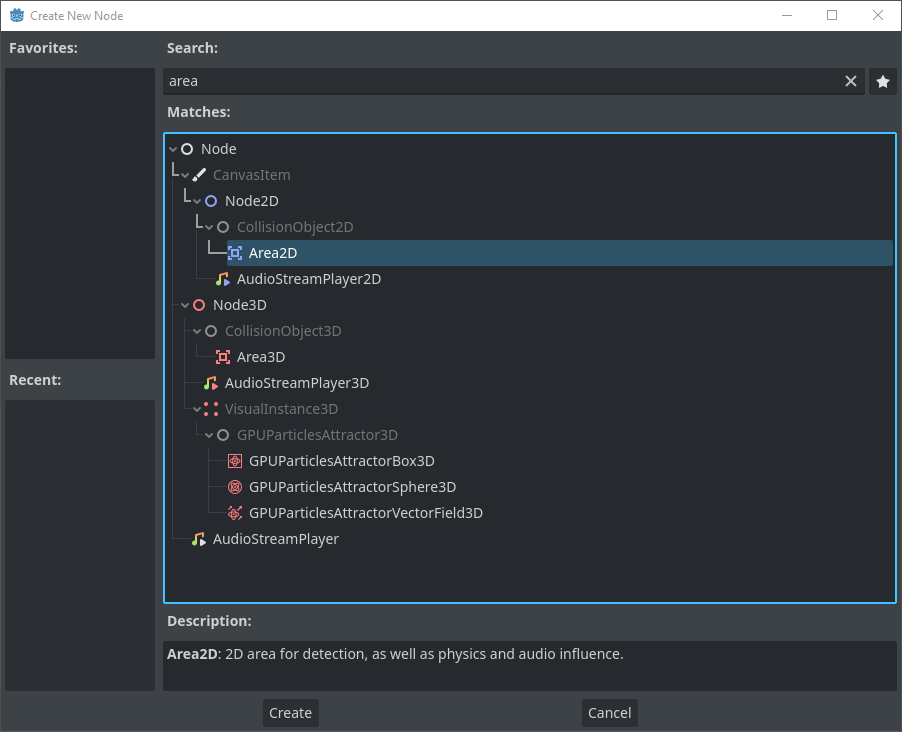

.. note::
    The exclamation point beside the new Player node is just to inform that there is no collision shape set yet.

    .. image:: img/102-player-added-warning.png

Right click the Player node and add a Sprite2D node.

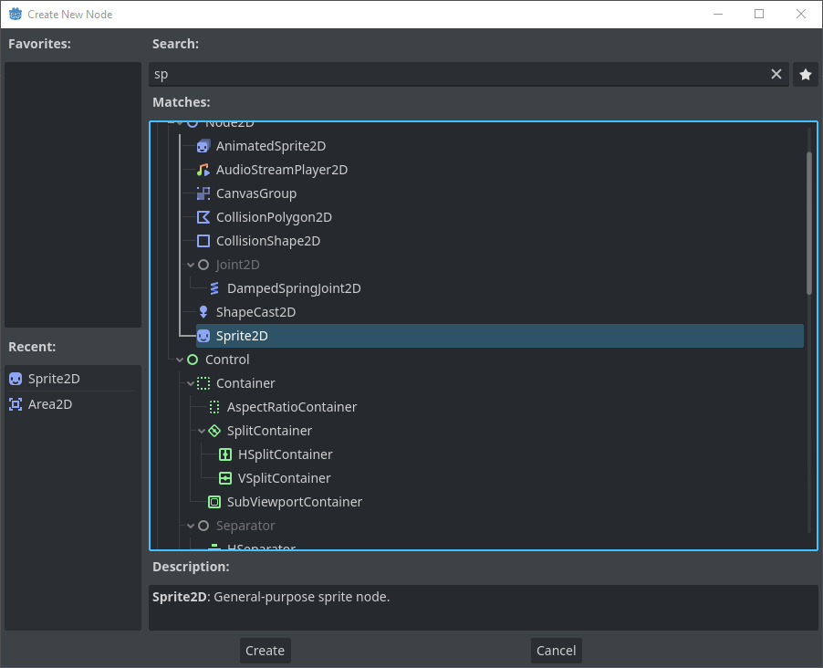

Right click the player node again and add a CollisionShape2D node.

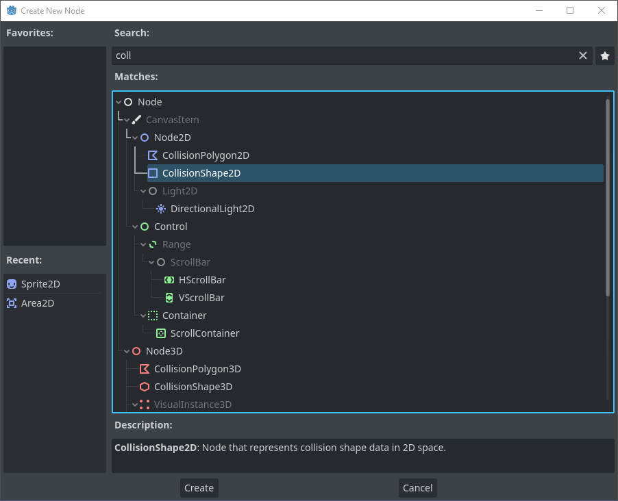

Your scene should be arranged like the following image.

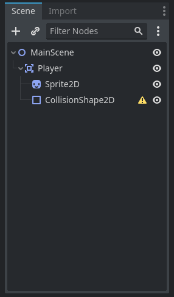

Now extract the assets and drag and drop them on the filesystem tab in the Godot editor.

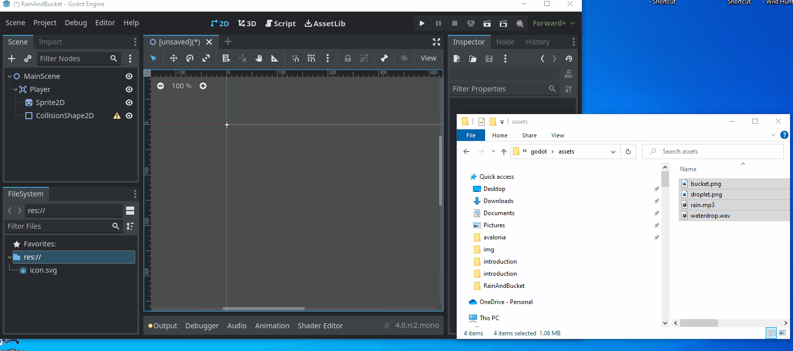

Once the assets are added, select the player sprite node and drag and drop the bucket.png image to the texture for the sprite.

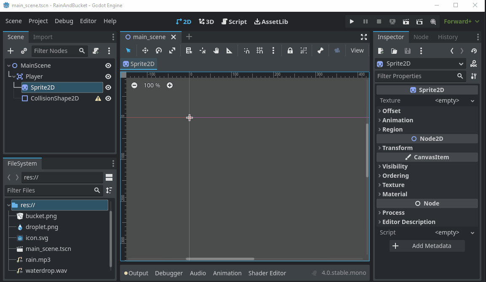

Now select the collision shape, and a new Rectangle shape and expand it to cover the bucket opening.

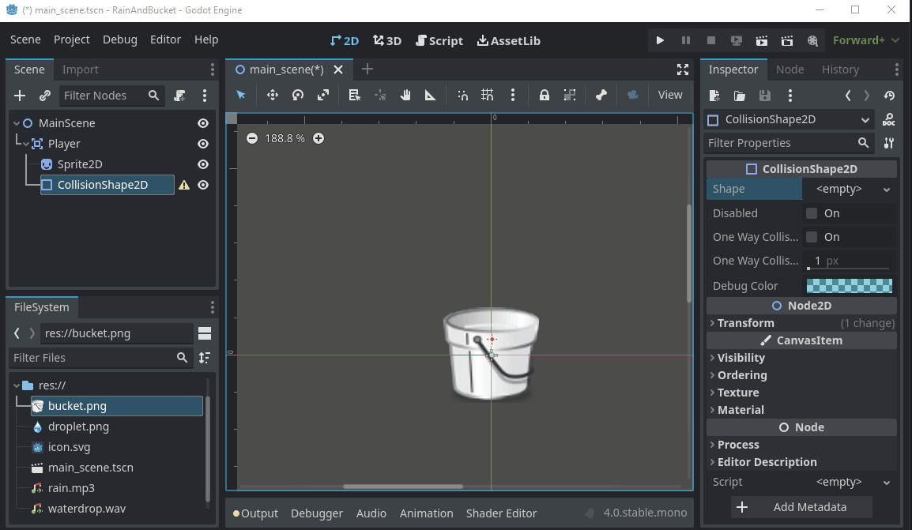

Rename the Sprite2D node to be PlayerSprite, and rename the collision shape to be PlayerCollides.  It should look like this:

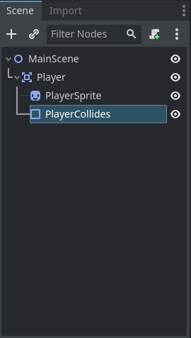

Next right click the player node and choose Add Child Node from the context menu.  Select AudioStreamPlayer

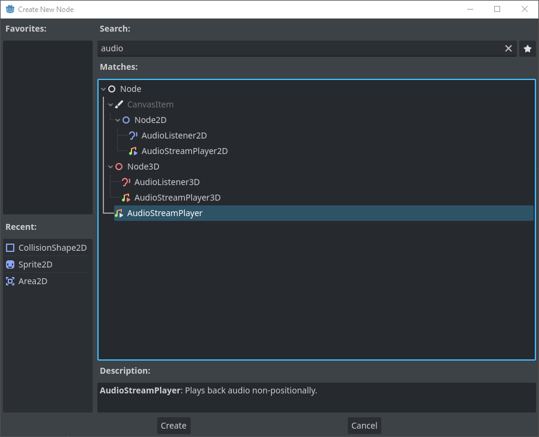

Rename it DropCaughtAudio, and then drag and drop the waterdrop.wav file onto the stream property for the node.

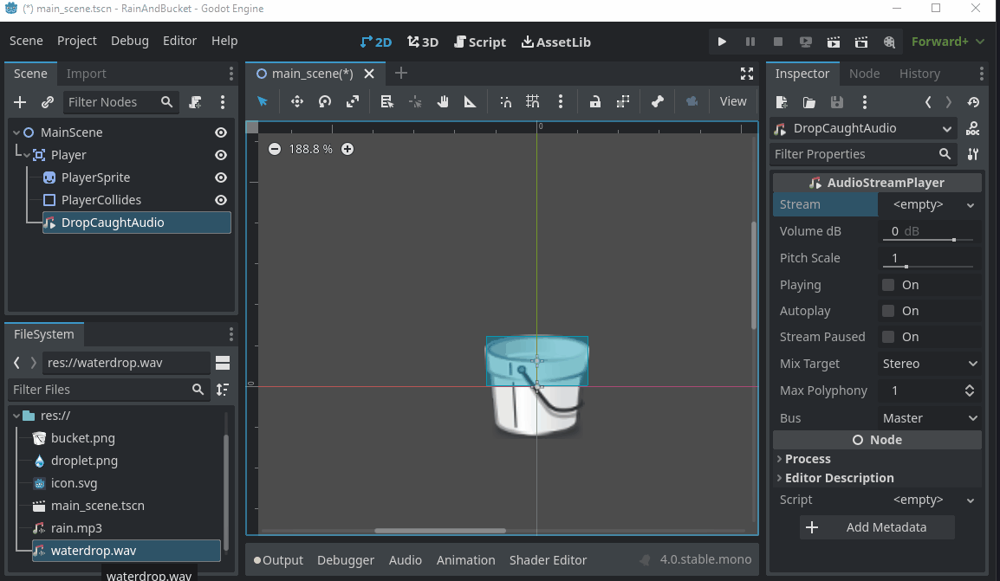

Now add an AudioStreamPlayer to main node.  Call it RainSounds and drag and drop the rain.mp3 onto the stream property, lastly set it to autoplay:

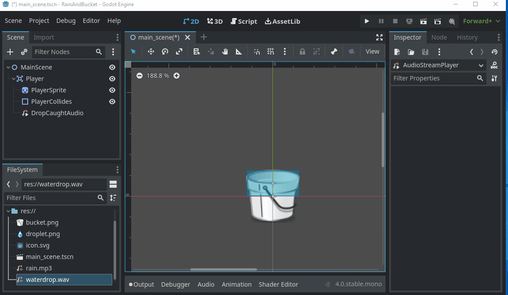

Now save the scene.  This will be the main scene.  Now it's time to extend the scene with some scripts.

Main Scene Initial Scripting
----------------------------

If we run the main scene at this point you should hear rain falling, however it stops after 31 seconds.   To remedy this, what we have to do is capture the signal emitted
when the audio stops and restart it.  Right click the main node and choose Attach Script.

.. tabs::

   .. tab:: C#

      .. image:: img/102-scripting-attach-csharp.png

      After attaching the script the Godot editor will open the newly created C# partial class.

     .. image:: img/102-scripting-csharp-script-editor.png

   .. tab:: GDScript

      .. image:: img/102-scripting-attach-script-gd.png

      After attaching the script. the Godot editor will open the newly created GD script object

      .. image:: img/102-scripting-gdscript-editor.png

First declare a field of type AudioStreamPlayer named audioPlayer, then create a method called OnRainSoundsFinished().

.. tabs::
    .. code-tab:: c# C#

        /// 

        /// Handles the emit of OnRainSoundsFinished by the RainSounds node.  When the signal is received
        /// it simply restarts the audio stream.
        /// 

        private void OnRainSoundsFinished()
        {
            // play rain sounds from the beginning
            audioPlayer.Play(0);
        }

    .. code-tab:: gdscript GDScript

        # coming soon.
        code here

Then add the following code to _Ready() which will capture a reference to the audio player object as well as handle the emit of the finished signal from the audio player.

.. tabs::
    .. code-tab:: c# C#

        // Called when the node enters the scene tree for the first time.
        public override void _Ready()
        {
            // cache the audio player
            audioPlayer = (AudioStreamPlayer) GetNode("RainSounds");

            // handle the emit of the finished signal
            audioPlayer.Finished += () => OnRainSoundsFinished();
        }

    .. code-tab:: gdscript GDScript

        # coming soon.
        code here

The script should look like this:

.. tabs::
    .. code-tab:: c# C#

        using Godot;
        using System;

        public partial class MainScene : Node2D
        {
            // cache the audio player so we can access it without using GetNode each time
            AudioStreamPlayer audioPlayer;

            // Called when the node enters the scene tree for the first time.
            public override void _Ready()
            {
                // cache the audio player
                audioPlayer = (AudioStreamPlayer) GetNode("RainSounds");

                // handle the emit of the finished signal
                audioPlayer.Finished += () => OnRainSoundsFinished();
            }

            /// 

            ///  Handles the emit of OnRainSoundsFinished by the RainSounds node.  When the signal is received
            /// it simply restarts the audio stream.
            /// 

            private void OnRainSoundsFinished()
            {
                // play rain sounds from the beginning
                audioPlayer.Play(0);
            }

            // Called every frame. 'delta' is the elapsed time since the previous frame.
            public override void _Process(double delta)
            {
            }
        }

    .. code-tab:: gdscript GDScript

        # coming soon.
        code here

Now when the scene is run the rain sounds should start up again after they have finished playing.

Player Initial Scripting
------------------------

Now right click the Player node

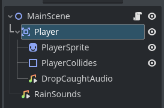

And attach a script to it.

.. note::
    If using C# make sure it's called Player.cs with a capital P.

First declare two Vector2 fields one to hold half the size of the collision shape for the bucket, called _halfOfCollisionBoundrySize
and one for the viewport size,called _screenSize.

Also add a field of type AudioStreamPLayer called _audioPlayer.  The field names are prefaced with the underscore as
they are declared private in scope.

Lastly add a field with the [Export] attribute that's public in scope and of type float, called Speed.  Once we build the project the export attribute
will allow the bucket movement speed in the Godot editor, in the Inspector panel.

.. tabs::
    .. code-tab:: c# C#

        // half the size of the collision shape for the bucket sprite
        private Vector2 _halfOfCollisionBoundrySize;

        // size of the current Godot viewport
        private Vector2 _screenSize;

        // cache the audio player so we don't have to use GetNode each time we want to play
        // the rain drop caught audio
        private AudioStreamPlayer _audioPlayer;

        // Export the movement speed of the bucket so it can be changed in the Godot editor for
        // fine tuning
        [Export] public float Speed  = 400;

    .. code-tab:: gdscript GDScript

        # coming soon.
        code here

Next add code to _Ready() to get a reference to the viewport screen size, and the collision shape for determining screen boundaries for the bucket.
Last thing to do is add a reference to the audio player so audio can be played when a rain drop is caught by the bucket.

.. tabs::
    .. code-tab:: c# C#

        // Called when the node enters the scene tree for the first time.
        public override void _Ready()
        {
        // set the screen size for ease of access
        _screenSize = GetViewportRect().Size;

        // set the half size of the  collision shape so we can check out of bounds based on
        // the edge of the collision shape instead of the center
        CollisionShape2D playerCollision = (CollisionShape2D) GetNode("PlayerCollides");
        _halfOfCollisionBoundrySize = playerCollision.Shape.GetRect().Size / 2;

        // cache the audio player so it is readily available for playing the audio when a drop is caught.
        _audioPlayer = (AudioStreamPlayer) GetNode("DropCaughtAudio");
        }

    .. code-tab:: gdscript GDScript

        # coming soon.
        code here

Next thing to do is code the movement of the Bucket.  This will go in the _Process() method.  Instead of using multiple if statements to determine bounds though,
this time we'll use the `Godot clamp function <https://docs.godotengine.org/en/stable/contributing/development/core_and_modules/common_engine_methods_and_macros.html#clamp-a-value>`_
to keep the sprite within the screen bounds.

.. tabs::
    .. code-tab:: c# C#

        public override void _Process(double delta)
        {
            // create the movement vector for the player
            Vector2 velocity = Vector2.Zero;

            // set movement along the x axis to be 1 pixel to the right
            if (Input.IsActionPressed("ui_right"))
            {
                velocity.X += 1;
            }

            // set movement along the x axis to be 1 pixel to the left
            if (Input.IsActionPressed("ui_left"))
            {
                velocity.X -= 1;
            }

            // if user has pressed either of the above keys then
            // multiply the 1 pixel times the movement speed
            if (velocity.Length() > 0)
            {
                velocity = velocity.Normalized() * Speed;
            }

            // Read the current Position data into a local variable as it is a struct
            Vector2 currentPosition = Position;

            // set the current position to be the elapsed time since last update multiplied by the
            // velocity which was set based on the value of the Speed field.
            currentPosition += velocity * (float)delta;

            // get the maximum x axis value based on the collision shape extents for the Player
            float maximumXvalue = _screenSize.X -  _halfOfCollisionBoundrySize.X;

            // use Clamp to ensure the position of the bucket is inside the bounds of hte viewport
            currentPosition.X = Mathf.Clamp(currentPosition.X, _halfOfCollisionBoundrySize.X, maximumXvalue);

            // set the Player's position to the currentPosition value
            Position = currentPosition;
        }

    .. code-tab:: gdscript GDScript

        # coming soon.
        code here

Now open the Project settings from the project menu and change the window size to 480x800.

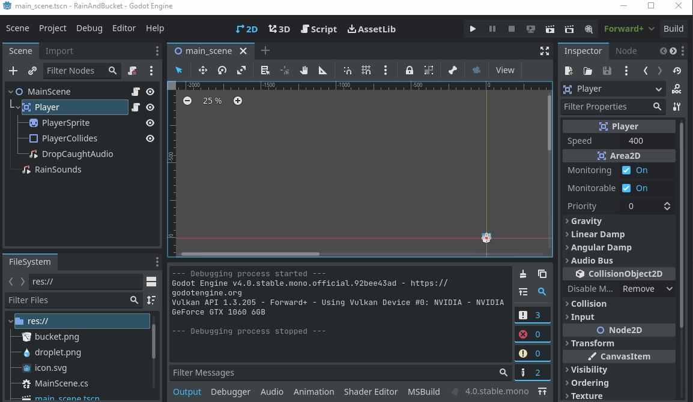

Now switch to the 2D view, and select the Player node.  Click the Group button so that when the bucket is moved the sprite and collision shapes all stay together.  After they are grouped, move the bucket till
it is roughly in the middle horizontally and at the bottom of the screen.

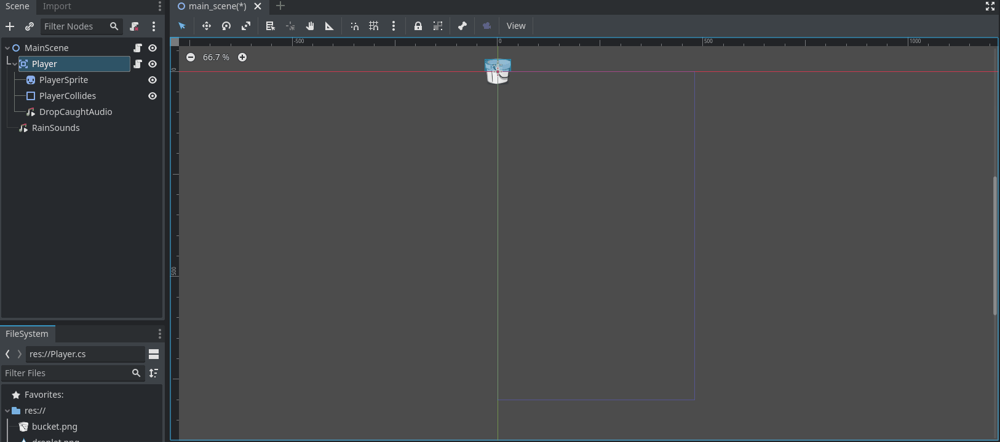

Now you can run the scene, and be able to move the bucket side to side within the confines of the screen and hear the sound of rain falling.

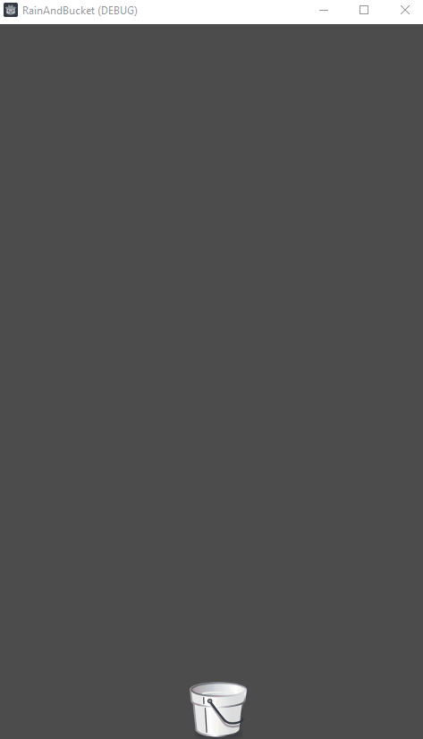

If you haven't clicked the main play button, or haven't set this scene to be the main scene do so now, by clicking the Play button and choosing current scene.

Creating The Raindrop Scene
---------------------------

After saving the main scene, click the Scene->New Scene menu item.  Select Area2D as the parent node and name it Raindrop.

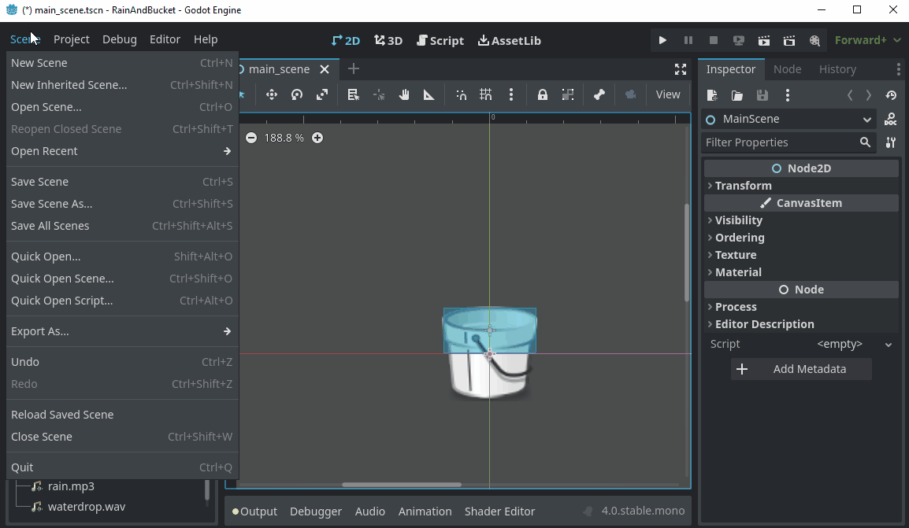

Now add a Sprite2D node to the Raindrop node, call it RaindropSprite, and add a CollisionShape2D child node as well.

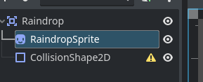

Drag and drop droplet.png onto the texture for the sprite.  Then select the CollisionShape2D node and add a new capsule shape, stretch it a bit so the shape encompasses most of the darker part of the drop.

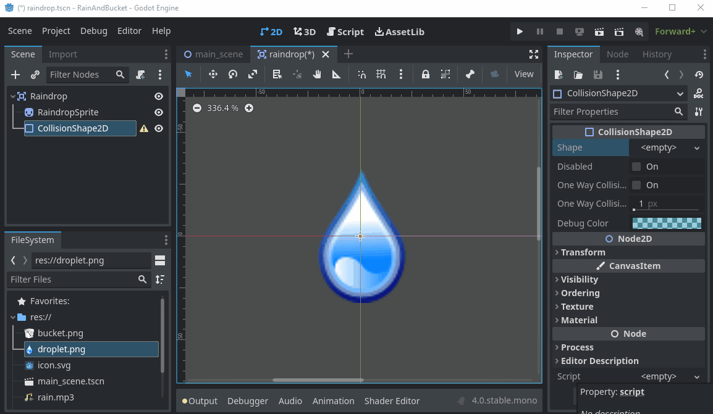

Save the scene.

Raindrop Script
---------------

Right click the top level node called Raindrop and choose Attach Script.

.. note::
    If using C# make sure it's called Raindrop.cs with a capital R.

Add the following fields to the script:

.. tabs::
    .. code-tab:: c# C#

        // create a group for the raindrop properties that are to be exported
        [ExportGroup("Raindrop Properties")]

        // allow raindrop initial speed to be set in the inspector pane of the Godot editor
        [Export]
        public float Speed = 400;

        // also allow rain drop acceleration to be set in the editor.
        [Export]
        public float Acceleration = 10;

    .. code-tab:: gdscript GDScript

        # coming soon.
        code here

Next add two new methods, one will handle when another Area2D object collides with the rain drop, and one to handle when the rain drop leaves the bottom of the screen exiting the scene.

.. tabs::
    .. code-tab:: c# C#

        /// 

        /// Handles when the raindrop is about to leave the view screen by falling through the bottom..
        /// Because the raindrop is no longer visible we remove it, freeing any resources it is using.
        /// 

        private void OnLeavingViewPort()
        {
            //remove the rain drop from the Node tree when it leaves the scene
            GetTree().QueueDelete(this);
        }

        /// 

        /// Handles the signal emitted when another Area2D object collides with this object.  A check is made to see if the
        /// colliding object is the player and if so removes the raindrop from the scene.
        /// 

        /// <param name="area">The Area2D object that has collided with this rain drop</param>
        private void OnAreaEntered(Area2D area)
        {
            // check if the colliding area is the player, so that rain drops colliding with each other
            // don't trigger their deletion from the tree.
            if (area.Name.Equals("Player"))
            {
                // Player caught the drop so remove it from the Node tree
                GetTree().QueueDelete(this);
            }
        }

    .. code-tab:: gdscript GDScript

        # coming soon.
        code here

Now alter _Process() so that the rain drop is moved along the Y axis, using the acceleration and speed field values to determine how far to fall each time _Process() is called.

.. tabs::
    .. code-tab:: c# C#

       // Called every frame. 'delta' is the elapsed time since the previous frame.
        public override void _Process(double delta)
        {
            // create an empty Vector2 , equivalent to new Vector2()
            Vector2 velocity = Vector2.Zero;

            // move the drop along the Y axis
            velocity.Y += 1;

            // calculate the how far the drop has moved
            velocity = velocity * Speed;

            // get the current position
            Vector2 currentPosition = Position;

            // increase the position by movement size times elapsed time
            currentPosition += velocity * (float)delta;

            // if the center of the raindrop is at the bottom of the screen
            if (currentPosition.Y >= 800)
            {
                //remove it
                OnLeavingViewPort();
            }
            else
            {
                // set the new rain drop position
                Position = currentPosition;

                // increase speed so the drop continues to accelerate on the way down.
                Speed += Acceleration;
            }

        }

    .. code-tab:: gdscript GDScript

        # coming soon.
        code here

Raindrop Full Code
------------------

Your Raindrop object should now look something like this:

.. tabs::
    .. code-tab:: c# C#

       using Godot;
        using System;

        public partial class Raindrop : Area2D
        {
            // create a group for the raindrop properties that are to be exported
            [ExportGroup("Raindrop Properties")]

            // allow raindrop initial speed to be set in the inspector pane of the Godot editor
            [Export]
            public float Speed = 400;

            // also allow rain drop acceleration to be set in the editor.
            [Export]
            public float Acceleration = 10;

            // Called when the node enters the scene tree for the first time.
            public override void _Ready()
            {
                // handle are entered signal when it is emitted
                AreaEntered += area => OnAreaEntered(area);
            }

            /// 

            /// Handles when the raindrop is about to leave the view screen by falling through the bottom..
            /// Because the raindrop is no longer visible we remove it, freeing any resources it is using.
            /// 

            private void OnLeavingViewPort()
            {
                //remove the rain drop from the Node tree when it leaves the scene
                GetTree().QueueDelete(this);
            }

            /// 

            /// Handles the signal emitted when another Area2D object collides with this object.  A check is made to see if the
            /// colliding object is the player and if so removes the raindrop from the scene.
            /// 

            /// <param name="area">The Area2D object that has collided with this rain drop</param>
            private void OnAreaEntered(Area2D area)
            {
                // check if the colliding area is the player, so that rain drops colliding with each other
                // don't trigger their deletion from the tree.
                if (area.Name.Equals("Player"))
                {
                    // Player caught the drop so remove it from the Node tree
                    GetTree().QueueDelete(this);
                }
            }

            // Called every frame. 'delta' is the elapsed time since the previous frame.
            public override void _Process(double delta)
            {
                // create an empty Vector2 , equivalent to new Vector2()
                Vector2 velocity = Vector2.Zero;

                // move the drop along the Y axis
                velocity.Y += 1;

                // calculate the how far the drop has moved
                velocity = velocity * Speed;

                // get the current position
                Vector2 currentPosition = Position;

                // increase the position by movement size times elapsed time
                currentPosition += velocity * (float)delta;

                // if the center of the raindrop is at the bottom of the screen
                if (currentPosition.Y >= 800)
                {
                    //remove it
                    OnLeavingViewPort();
                }
                else
                {
                    // set the new rain drop position
                    Position = currentPosition;

                    // increase speed so the drop continues to accelerate on the way down.
                    Speed += Acceleration;
                }

            }
        }

    .. code-tab:: gdscript GDScript

        # coming soon.
        code here

Finalizing the Main scene Object
--------------------------------

Save the scene.  Now switch back to the main scene, and add an instance of the raindrop scene, position the drop somewhere along the X-axis at the top of the viewport.

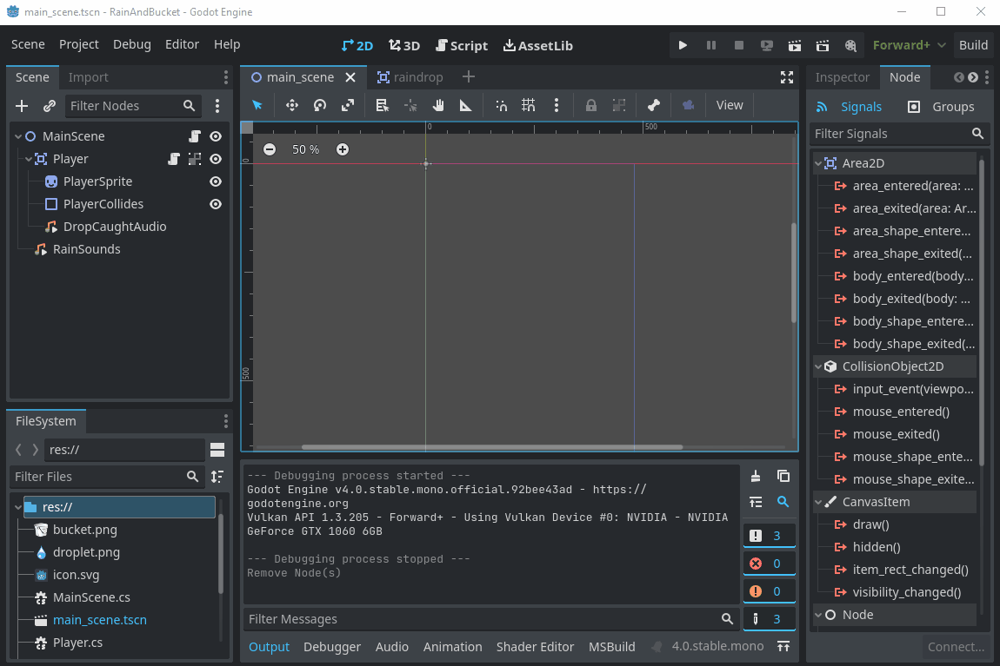

At this point if you run the main scene you should have a falling raindrop.

Now open the script for the main scene, it's time to add a timer so that new rain drops are spawned as needed.

First step is to add fields to track elapsed time since the last rain drop was spawned, a field to hold the rain drop scene, a field for generating random numbers, and lastly
an exported field to allow setting the drop spawn rate in the Godot editor's Inspector pane.

.. tabs::
    .. code-tab:: c# C#

       // track how much time has elapsed since the last rain drop
        private double _elapsedTime;

        // cache the raindrop scene so we can instantiate it as needed
        private PackedScene _rainDrop;

        // random number generator to generate rain drop placement on the x axis
        private Random _randomNumber = new Random();

        // Export spawn rate so it is possible to change value in the Godot editor
        // This value is how many seconds to wait before spawning a new rain drop
        [Export]
        public double SpawnRate = 1; // default is to spawn a new drop each second,

    .. code-tab:: gdscript GDScript

        # coming soon.
        code here

Next add code to _Ready() to load the Raindrop scene into memory.

.. tabs::
    .. code-tab:: c# C#

            // cache the raindrop scene
            _rainDrop =  GD.Load<PackedScene>("res://raindrop.tscn");

    .. code-tab:: gdscript GDScript

        # coming soon.
        code here

Ready should now look something like this:

.. tabs::
    .. code-tab:: c# C#

       // Called when the node enters the scene tree for the first time.
        public override void _Ready()
        {
            // cache the audio player
            audioPlayer = (AudioStreamPlayer) GetNode("RainSounds");

            // handle the emit of the finished signal
            audioPlayer.Finished += () => OnRainSoundsFinished();

            // cache the raindrop scene
            _rainDrop =  GD.Load<PackedScene>("res://raindrop.tscn");
        }

    .. code-tab:: gdscript GDScript

        # coming soon.
        code here

Next add a method to spawn new rain drops as needed.

.. tabs::
    .. code-tab:: c# C#

        /// 

        /// Spawns a new rain drop with a random location on the X axis
        /// 

        private void SpawnRaindrop()
        {
            // instantiate the raindrop scene
            Raindrop drop = (Raindrop) _rainDrop.Instantiate();

            // set the position to be random along the x axis
            drop.Position = new Vector2(_randomNumber.Next(16,448), 0);

            // add the rain drop scene to the main scene
            AddChild(drop);
        }

    .. code-tab:: gdscript GDScript

        # coming soon.
        code here

Lastly add code to _Process() to check the elapsed time since the last rain drop and call the SpawnRaindrop method if necessary.

.. tabs::
    .. code-tab:: c# C#

        // Called every frame. 'delta' is the elapsed time since the previous frame.
        public override void _Process(double delta)
        {
            // add delta to the elapsed time
            _elapsedTime += delta;

            // if elapsed time is greater than spawn rate , spawn a new rain drop
            // and reset elapsed time
            if (_elapsedTime >= SpawnRate)
            {
                SpawnRaindrop();
                _elapsedTime = 0;
            }
        }

    .. code-tab:: gdscript GDScript

        # coming soon.
        code here

Main scene Full Code
--------------------

Here's the code for the main scene in full:

.. tabs::
    .. code-tab:: c# C#

        using Godot;
        using System;

        public partial class MainScene : Node2D
        {
            // cache the audio player so we can access it without using GetNode each time
            AudioStreamPlayer audioPlayer;

            // track how much time has elapsed since the last rain drop
            private double _elapsedTime;

            // cache the raindrop scene so we can instantiate it as needed
            private PackedScene _rainDrop;

            // random number generator to generate rain drop placement on the x axis
            private Random _randomNumber = new Random();

            // Export spawn rate so it is possible to change value in the Godot editor
            // This value is how many seconds to wait before spawning a new rain drop
            [Export]
            public double SpawnRate = 1; // default is to spawn a new drop each second,

            // Called when the node enters the scene tree for the first time.
            public override void _Ready()
            {
                // cache the audio player
                audioPlayer = (AudioStreamPlayer) GetNode("RainSounds");

                // handle the emit of the finished signal
                audioPlayer.Finished += () => OnRainSoundsFinished();

                // cache the raindrop scene
                _rainDrop =  GD.Load<PackedScene>("res://raindrop.tscn");
            }

            /// 

            ///  Handles the emit of OnRainSoundsFinished by the RainSounds node.  When the signal is received
            /// it simply restarts the audio stream.
            /// 

            private void OnRainSoundsFinished()
            {
                // play rain sounds from the beginning
                audioPlayer.Play(0);
            }

            // Called every frame. 'delta' is the elapsed time since the previous frame.
            public override void _Process(double delta)
            {
                // add delta to the elapsed time
                _elapsedTime += delta;

                // if elapsed time is greater than spawn rate , spawn a new rain drop
                // and reset elapsed time
                if (_elapsedTime >= SpawnRate)
                {
                    SpawnRaindrop();
                    _elapsedTime = 0;
                }
            }

            /// 

            /// Spawns a new rain drop with a random location on the X axis
            /// 

            private void SpawnRaindrop()
            {
                // instantiate the raindrop scene
                Raindrop drop = (Raindrop) _rainDrop.Instantiate();

                // set the position to be random along the x axis
                drop.Position = new Vector2(_randomNumber.Next(16,448), 0);

                // add the rain drop scene to the main scene
                AddChild(drop);
            }
        }

    .. code-tab:: gdscript GDScript

        # coming soon.
        code here

Finalizing the Player Class
---------------------------

If you haven't already done save the scene.  Open the Player class file, Player.cs, and add the following method that will handle the signal
emitted when another Area2D object collides with the Player.  It will play the waterdrop.wav file each time a drop is caught.

.. tabs::
    .. code-tab:: c# C#

        /// 

        ///  Handles emit of the signal onAreaEntered for the Player object
        /// 

        /// <param name="area">The collision area that has collided with the player's collision area</param>
        private void OnAreaEntered(Area2D area)
        {
            // get the name of the area that collided with the player
            string areaName = area.Name;

            // if the area name contains raindrop then we play the audio for when a drop is caught.
            // each time a Raindrop is created it has a unique name, and therefore Equals should not be used here
            if (areaName.Contains("Raindrop"))
            {
                // this next line prints the name of the Raindrop that has collided with the bucket
                // as you can see from the output of this line, that names are unique even though we are spawning the same raindrop scene
                // this line is printed to the output window in the Godot editor or the console window if running in an
                // IDE like Rider or Visual Studio
                GD.Print($"Raindrop Name: {area.Name}");

                // play the drop caught sound
                _audioPlayer.Play(0);
            }
        }

    .. code-tab:: gdscript GDScript

        # coming soon.
        code here

Add the following code to the _Ready() method so that when the AreaEntered signal is emitted it is directed to the new method that was just created.

.. tabs::
    .. code-tab:: c# C#

        // handle signal emitted when another Area2D derived object has collided with the bucket.
        AreaEntered += area => OnAreaEntered(area);

    .. code-tab:: gdscript GDScript

        # coming soon.
        code here

Player Full Code
----------------

Here's the entire Player object code:

.. tabs::
    .. code-tab:: c# C#

       using Godot;
        using System;

        public partial class Player : Area2D
        {
            // half the size of the collision shape for the bucket sprite
            private Vector2 _halfOfCollisionBoundrySize;

            // size of the current Godot viewport
            private Vector2 _screenSize;

            // cache the audio player so we don't have to use GetNode each time we want to play
            // the rain drop caught audio
            private AudioStreamPlayer _audioPlayer;

            // Export the movement speed of the bucket so it can be changed in the Godot editor for
            // fine tuning
            [Export] public float Speed  = 400;

            // Called when the node enters the scene tree for the first time.
            public override void _Ready()
            {
                // set the screen size for ease of access
                _screenSize = GetViewportRect().Size;

                // set the half size of the  collision shape so we can check out of bounds based on
                // the edge of the collision shape instead of the center
                CollisionShape2D playerCollision = (CollisionShape2D) GetNode("PlayerCollides");
                _halfOfCollisionBoundrySize = playerCollision.Shape.GetRect().Size / 2;

                // cache the audio player so it is readily available for playing the audio when a drop is caught.
                _audioPlayer = (AudioStreamPlayer) GetNode("DropCaughtAudio");

                // handle signal emitted when another Area2D derived object has collided with the bucket.
                AreaEntered += area => OnAreaEntered(area);
            }

            // Called every frame. 'delta' is the elapsed time since the previous frame.
            public override void _Process(double delta)
            {
                // create the movement vector for the player
                Vector2 velocity = Vector2.Zero;

                // set movement along the x axis to be 1 pixel to the right
                if (Input.IsActionPressed("ui_right"))
                {
                    velocity.X += 1;
                }

                // set movement along the x axis to be 1 pixel to the left
                if (Input.IsActionPressed("ui_left"))
                {
                    velocity.X -= 1;
                }

                // if user has pressed either of the above keys then
                // multiply the 1 pixel times the movement speed
                if (velocity.Length() > 0)
                {
                    velocity = velocity.Normalized() * Speed;
                }

                // Read the current Position data into a local variable as it is a struct
                Vector2 currentPosition = Position;

                // set the current position to be the elapsed time since last update multiplied by the
                // velocity which was set based on the value of the Speed field.
                currentPosition += velocity * (float)delta;

                // get the maximum x axis value based on the collision shape extents for the Player
                float maximumXvalue = _screenSize.X -  _halfOfCollisionBoundrySize.X;

                // use Clamp to ensure the position of the bucket is inside the bounds of hte viewport
                currentPosition.X = Mathf.Clamp(currentPosition.X, _halfOfCollisionBoundrySize.X, maximumXvalue);

                // set the Player's position to the currentPosition value
                Position = currentPosition;
            }

            /// 

            ///  Handles emit of the signal onAreaEntered for the Player object
            /// 

            /// <param name="area">The collision area that has collided with the player's collision area</param>
            private void OnAreaEntered(Area2D area)
            {
                // get the name of the area that collided with the player
                string areaName = area.Name;

                // if the area name contains raindrop then we play the audio for when a drop is caught.
                // each time a Raindrop is created it has a unique name, and therefore Equals should not be used here
                if (areaName.Contains("Raindrop"))
                {
                    // this next line prints the name of the Raindrop that has collided with the bucket
                    // as you can see from the output of this line, that names are unique even though we are spawning the same raindrop scene
                    // this line is printed to the output window in the Godot editor or the console window if running in an
                    // IDE like Rider or Visual Studio
                    GD.Print($"Raindrop Name: {area.Name}");

                    // play the drop caught sound
                    _audioPlayer.Play(0);
                }
            }
        }

    .. code-tab:: gdscript GDScript

        # coming soon.
        code here

Save the scene and run it. When you catch a drop in the bucket it should play the drop caught sound.

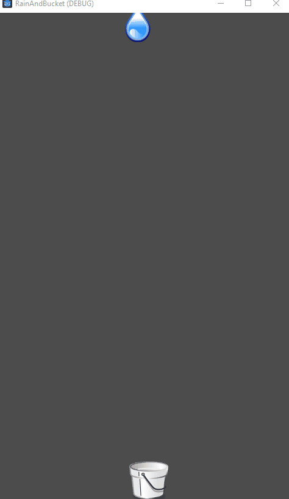

Note the exported variable can be accessed through the inspector to fine tune the movement and spawn rate for example, select the main node, and set SpawnRate to be 0.1.

Now you get 10 drops a second.  Or you can select the Player node and adjust the speed at which the bucket moves by adjusting the Speed.

Or note the Raindrop scene has it own group for setting Speed and or Acceleration.

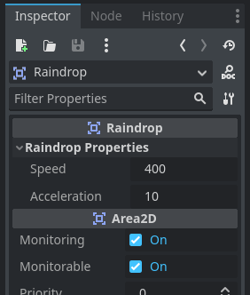

Source Code
-----------

C# Project :download:`RainAndBucket.zip <files/RainAndBucket.zip>`

Link here to Github repo

References
----------

Godot Classes:

`Area2D <https://docs.godotengine.org/en/stable/classes/class_area2d.html>`_

`CollisionShape2D <https://docs.godotengine.org/en/stable/classes/class_collisionshape2d.html>`_

`AudioStreamPLayer <https://docs.godotengine.org/en/stable/classes/class_audiostreamplayer.html>`_

`PackedScene <https://docs.godotengine.org/en/stable/classes/class_packedscene.html>`_

Godot Functions:

`Clamp <https://docs.godotengine.org/en/stable/contributing/development/core_and_modules/common_engine_methods_and_macros.html#clamp-a-value>`_
